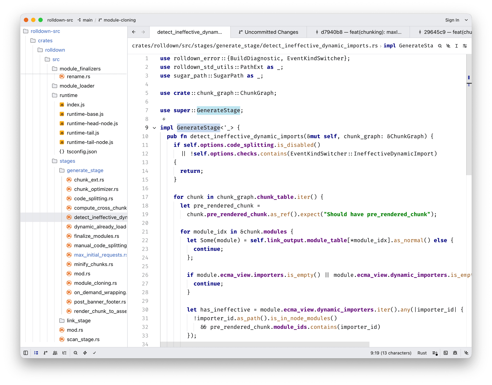

# Classic Light (IntelliJ-inspired) — a Zed theme

A light theme for [Zed](https://zed.dev) that ports the color values of
JetBrains IntelliJ's **"Classic Light"** editor color scheme (the legacy
*Default* scheme, presented as *Classic Light* in the New UI).

The palette is taken directly from JetBrains' own
[`DefaultColorSchemesManager.xml`](https://github.com/JetBrains/intellij-community/blob/master/platform/platform-resources/src/DefaultColorSchemesManager.xml),
so syntax colors, the caret-row highlight, selection, gutter, diff/VCS status
colors and the terminal ANSI palette match the original.

> **Not affiliated with or endorsed by JetBrains s.r.o.** "JetBrains" and
> "IntelliJ" are trademarks of JetBrains s.r.o. This is an independent,
> community-made color port for Zed.



## Highlights

The defining trait of Classic Light is preserved: most code stays **black**,
and only a few token classes are colored.

| Token | Color | Style |
| --- | --- | --- |
| Keywords | `#000080` | bold |
| Strings | `#008000` | bold |
| Numbers | `#0000ff` | — |
| Comments / doc | `#808080` | italic |
| Fields / constants | `#660e7a` | bold / bold-italic |
| Annotations | `#808000` | — |
| Classes, functions, params, operators | `#000000` | — |

Editor background `#ffffff`, active line `#fffae3`, line numbers `#999999`.

### UI chrome — matched to "Islands Light"

The UI chrome (title bar, status bar, editor tabs, sidebar, borders, hover and
selection states) is colour-matched to JetBrains' **"Islands Light"** UI theme:
grey `#e9eaee` window chrome, a white active editor tab over greyed inactive
tabs, a white sidebar with a grey `#e9eaee` selection fill, and translucent-black
hover states. For the closest overall match, use this color theme with the
**Islands Light** UI theme in your JetBrains IDE as the reference.

## Install

### From the Zed extensions registry

> Not yet published to the registry. Once it is, open the command palette →
> `zed: extensions`, search for **Classic Light (IntelliJ-inspired)**, and install.

### As a dev extension (now)

1. Clone this repo.
2. In Zed, open the command palette (`cmd-shift-p`) → **`zed: install dev extension`**.
3. Select this repo's folder.
4. Open the theme selector (`cmd-k cmd-t`) and pick **Classic Light (IntelliJ-inspired)**.

### Just the theme file

Copy [`themes/classic-light-intellij.json`](themes/classic-light-intellij.json)
into `~/.config/zed/themes/` and select it in the theme picker.

## Pairs well with

**Icons** — for the full JetBrains look, install the **JetBrains New UI Icon
Theme** extension (search `jetbrains` in `zed: extensions`) and select the
**JetBrains New UI Icons (Light)** icon theme. It matches the Islands UI that
this color theme targets:

```json
{
  "icon_theme": "JetBrains New UI Icons (Light)"
}
```

**Fonts** — for a JetBrains-like feel, use the OS UI font for Zed's interface
(`.SystemUIFont`) and a coding font like **Fira Code** (or JetBrains' own
**JetBrains Mono**) for the editor:

```json
{
  "ui_font_family": ".SystemUIFont",
  "buffer_font_family": "Fira Code",
  "buffer_font_features": { "calt": true }
}
```

## License

[MIT](LICENSE) © 2026 Stanislav Lashmanov. Color values are derived from
JetBrains' open-source IntelliJ Community scheme (Apache-2.0).
